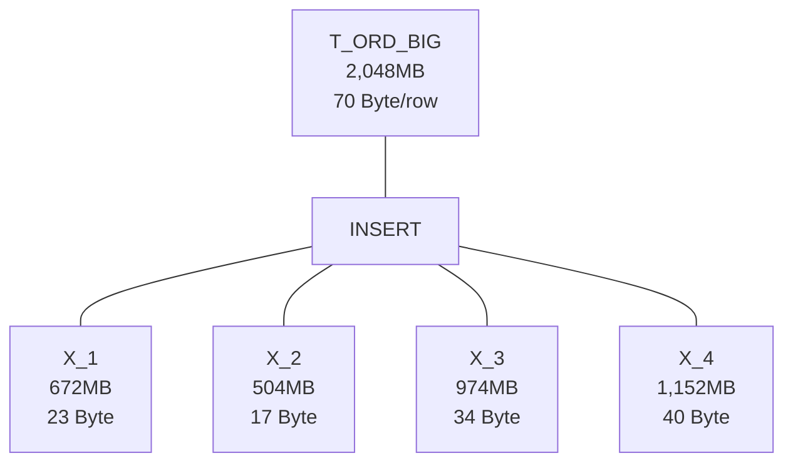

# 복합 인덱스의 컬럼 선정과 순서 정리

## 핵심 개념 : 데이터를 많이 걸러내는 컬럼을 앞에 배치해야 한다

복합 인덱스 사용 시 핵심 원칙

1. **선택도(Selectivity) 원칙**
    - 높은 선택도(데이터를 많이 걸러내는) 컬럼을 앞에 배치
    - '같다(=)' 조건은 일반적으로 '범위' 조건보다 선택도가 높음
2. **검색 효율성 원칙**
    - 인덱스 선두 컬럼이 정확히 일치할 때 다음 컬럼도 검색 범위 축소에 기여
    - 인덱스 선두 컬럼이 범위 조건일 때 다음 컬럼은 검색 범위 축소에 기여하지 못함
3. **데이터 정렬 원칙**
    - 복합 인덱스는 선언된 컬럼 순서대로 데이터를 정렬
    - 정렬 순서가 쿼리 조건과 일치할 때 최고의 성능 발휘

# 복합 인덱스 접근 과정 설명

B-Tree 인덱스의 기본 구조

B-Tree 인덱스는 루트 노드, 브랜치 노드, 리프 노드로 구성됨

데이터베이스가 인덱스를 이용해 데이터를 찾는 과정은 다음과 같다

1. 루트 노드에서 시작
2. 브랜치 노드를 통해 리프 노드로 이동
3. 리프 노드에서 필요한 데이터를 스캔
4. 리프 노드의 RID(Row Identifier)를 이용해 실제 테이블 데이터에 접근

# 인덱스 내부 동작 원리

## 인덱스 생성 시 동작 방식

- 인덱스 생성 시, 지정된 컬럼 기준으로 정렬된 구조 생성됨
- 구조는 루트 → 브랜치 → 리프 블록으로 구성됨
- 리프 블록에는 인덱스 키와 RID(행 식별자) 저장됨
- RID는 실제 테이블 레코드 위치 가리키는 포인터 역할함

## 복합 인덱스의 정렬 방식

- 첫 번째 컬럼 기준으로 정렬됨
- 첫 컬럼 값이 같으면 두 번째 컬럼 기준으로 정렬
- 이후 세 번째, 네 번째 컬럼 순서대로 정렬됨
- 순서는 인덱스 생성 시 지정한 컬럼 순서 그대로 따름

## 쿼리 실행 시 인덱스 활용 방식

- 예: 인덱스 (CUS_ID, ORD_YMD) 존재 시
    - `CUS_ID = 'CUS_0075'` 조건으로 탐색 시작 지점 빠르게 지정 가능
    - 이후 `ORD_YMD LIKE '201703%'` 조건도 인덱스로 함께 탐색 가능
- 반면 (ORD_YMD, CUS_ID) 순서일 경우
    - `ORD_YMD LIKE '201703%'`는 범위 조건이라 선두 조건 역할
    - `CUS_ID = 'CUS_0075'`는 후순위로 밀려 인덱스 탐색에 기여 못함
    - 전체 리프 블록 스캔 필요, 성능 저하됨

## RID를 통한 데이터 접근 방식

- 리프 블록에서 조건에 맞는 RID 추출
- RID 사용하여 테이블의 실제 행에 직접 접근
- 테이블 전체를 읽지 않고도 원하는 레코드만 조회 가능

## 인덱스 리프 블록의 구성

- 생성 시 지정된 모든 컬럼이 리프 블록에 포함됨
- 예: `CREATE INDEX idx_test ON table(ORD_YMD, CUS_ID, ORD_ST, AMOUNT)`
    - 리프 블록에 이 네 개 컬럼의 값 + RID 저장됨

## 리프 블록 정렬 순서와 그 영향

- ORD_YMD → CUS_ID → ORD_ST 순서로 정렬됨
- 컬럼 수 많을수록 리프 블록에 저장되는 정보 증가
- 리프 블록 크기 커짐 → 한 블록당 저장 가능한 레코드 수 감소
- 인덱스 전체 크기 증가 → 유지/쓰기 비용 증가

## 인덱스 커버링 효과

- SELECT, WHERE 절의 컬럼이 모두 인덱스에 포함된 경우
- 테이블 접근 없이 리프 블록만으로 결과 도출 가능
- 인덱스 온리 스캔(Index Only Scan) 가능
- 디스크 I/O, 버퍼 캐시 점유량 모두 절감됨

## 인덱스 구조 = 정렬된 뷰와 유사함

- 인덱스를 활용한 쿼리 처리 구조는 정렬된 임시 뷰와 유사하게 작동함
- 실제로 뷰를 생성하지 않으며, 내부 정렬된 구조를 활용해 빠른 조회 수행함

- 실제로 뷰를 생성하지 않으며, 내부 정렬된 구조를 활용해 빠른 조회 수행함

## 인덱스를 여러 개 생성할 수 있는 이유

- 하나의 테이블에 다양한 쿼리 패턴 존재함
- 각각의 조건 조합에 최적화된 인덱스를 따로 생성 가능함
    - 예: `(ORD_YMD, CUS_ID)`, `(CUS_ID, ORD_YMD)`, `(PRODUCT_ID, ORD_YMD)` 등

## 쿼리 실행 시 인덱스 선택 방식

- 데이터베이스 옵티마이저가 적절한 인덱스 선택함
- 기준: 조건절 구조, 선택도, 비용 모델, 예상 I/O
- 때로는 인덱스를 쓰지 않는 것이 더 빠르다고 판단해 테이블 전체 스캔 선택함

## 힌트를 통한 인덱스 선택 제어 가능

- `USE INDEX`, `FORCE INDEX`, `IGNORE INDEX` 등 힌트 제공 가능 (MySQL 기준)
- Oracle/SQL Server는 `/*+ INDEX(...) */` 또는 `WITH (INDEX(...))` 형태로 제어 가능
- 힌트 사용은 유지보수 난이도 존재 → 최후 수단으로 사용함

## 인덱스의 장점과 단점

| 항목 | 설명 |
| --- | --- |
| 장점 | 조회 성능 향상, 디스크 접근 최소화 |
| 단점 | INSERT/UPDATE/DELETE 시 동시 갱신 필요, 성능 저하 가능 |
| 공간 | 인덱스 크기 증가 시 저장 공간 부담 발생 |
| 유지보수 | 너무 많은 인덱스는 혼란 야기 → 주기적 정리 필요 |

## DBMS의 인덱스 생성 및 활용 흐름

1. 인덱스 생성 시:
    - `CREATE INDEX` 명령으로 생성함
    - PRIMARY KEY나 UNIQUE 제약 조건 지정 시 자동 생성됨
2. 쿼리 실행 시:
    - 옵티마이저가 이미 생성된 인덱스 중 가장 효율적인 것을 선택함
    - 비효율적이면 테이블 풀 스캔 선택함
3. 일부 DBMS의 자동 튜닝 기능:
    - Oracle: SQL Access Advisor
    - SQL Server: Database Engine Tuning Advisor
    - 자동 생성은 아님 → 추천만 수행, DBA 승인 필요함
  
## 높은 선택도 1. 카디널리티(Cardinality)가 높은 컬럼

카디널리티

컬럼에 저장된 값의 고유한 개수가 많을수록 선택도가 높다

- 주민등록번호, 이메일 주소, 사용자 ID 등 고유값을 가진 컬럼은 카디널리티가 높다.
- 성별, 국가코드 등 적은 개수의 값만 가지는 컬럼은 카디널리티가 낮다.

## 높은 선택도 2. 데이터가 균일하게 분포된 컬럼

데이터가 특정 값으로 편중되지 않고 고르게 분포될수록 선택도가 높다

- 날짜 및 타임스탬프 컬럼이 넓은 범위로 고르게 분포된 경우 선택도가 높다.
- 특정 날짜에만 데이터가 몰려 있으면 선택도가 낮다.

예를 들어, `gender` 컬럼이 있다고 가정

- 남성이 49%, 여성이 51%인 경우 (균등 분포)
    - `gender = 'M'` 조건은 약 49%의 데이터를 반환 (낮은 선택도)
    - 인덱스 효율이 낮음
- `status` 컬럼에 'active', 'inactive', 'pending', 'blocked' 값이 있고, 'active'가 95%인 경우 (불균등 분포)
    - `status = 'pending'` 조건은 약 1-2%의 데이터만 반환 (높은 선택도)
    - `status = 'active'` 조건은 약 95%의 데이터를 반환 (매우 낮은 선택도)
    - 같은 컬럼이라도 조건 값에 따라 인덱스 효율이 크게 달라짐

## 높은 선택도 3. NULL 또는 공백이 적은 컬럼

NULL 값이나 공백이 많으면 인덱스가 효율적으로 활용되기 어려우므로 선택도가 낮다.

- 모든 행에 값이 채워진 '전화번호' 컬럼은 선택도가 높다.
- NULL 값이 많은 '보조 이메일' 컬럼은 선택도가 낮다.

## 높은 선택도 4. 조건 검색에 빈번하게 사용되는 컬럼

조건절에서 자주 등장하며 검색 조건으로 쓰이는 컬럼일수록 인덱스 효과가 높아 선택도가 좋다.

- 주문상태 컬럼 중 '주문완료' 상태가 압도적으로 많다면, 선택도가 낮다.
- 다양한 상태(취소, 환불, 배송준비 등)가 고르게 존재한다면 선택도가 높다.

## 높은 선택도 5. 고유성 제약(Unique Constraint)이 있는 컬럼

Primary Key 또는 Unique 제약조건이 걸려 있는 컬럼은 값이 중복되지 않아 선택도가 매우 높다.

- 사용자 계정의 ID 컬럼이나 고유 코드가 설정된 컬럼은 선택도가 높다.

⇒ 이게 Oracle, MySQL, PostgreSQL 같은 데이터베이스가 Primary Key (PK)나 **Unique 제약 조건**이 설정된 컬럼에 자동으로 인덱스를 생성하는 이유 !!!

### 📌 자동 인덱스를 생성하는 이유

### 1. **고유성 보장**

- **PK** 또는 **Unique 제약조건**은 특정 컬럼에 중복값이 없음을 보장해야 한다.
- 이를 검사하려면 데이터베이스는 중복 여부를 빠르게 확인할 수 있는 구조가 필요하며, 이를 위해 자동으로 인덱스를 생성한다.

### 2. **높은 선택도 (Selectivity)**

- PK나 Unique 제약조건이 걸린 컬럼은 중복되지 않은 값을 가져 매우 높은 선택도를 가진다.
- 높은 선택도를 가진 컬럼에 인덱스를 만들면 효율적으로 데이터 탐색과 조회가 가능하다.

### 3. **성능 향상**

- PK 또는 Unique 컬럼은 자주 JOIN, WHERE 조건절로 사용되기 때문에, 인덱스가 없으면 성능이 크게 떨어질 수 있다.
- 자동으로 생성된 인덱스는 이러한 쿼리의 성능을 극대화한다.

### 4. **데이터 무결성 검사 속도**

- 데이터가 추가되거나 변경될 때 중복 여부 검사를 인덱스를 통해 빠르게 수행할 수 있기 때문에 데이터 변경 작업의 성능도 좋아진다.

### 5. **최적화된 구조 제공**

- 자동 생성된 인덱스는 대부분의 데이터베이스에서 최적화된 B-tree 구조로 제공된다.
- 이를 통해 빠르고 일관된 데이터 접근이 가능하다.

# 복합 인덱스 컬럼 순서 결정 원칙

## 1. 같다 조건이 LIKE 조건보다 앞에 = 높은 선택도 = 데이터를 더 많이 거른다

1. **기본 원칙**: '같다(=)' 조건이 사용된 컬럼을 복합 인덱스의 앞 부분에 두는 것이 유리하다.
2. **범위 조건**: '범위(>, <, LIKE)' 조건의 컬럼은 일반적으로 뒤쪽에 배치하는 것이 효율적이다.

## 실제 사례 분석

```sql
SELECT T1.ORD_ST, COUNT(*)
FROM T_ORD_BIG T1
WHERE T1.ORD_YMD LIKE '201703%'
AND T1.CUS_ID = 'CUS_0075'
GROUP BY T1.ORD_ST;
```

`ORD_YMD`는 LIKE 조건 사용 (범위 조건)

`CUS_ID`는 = 조건 사용 (같다 조건)

### CASE 1 :  'ORD_YMD, CUS_ID' 순서로 인덱스 구성

```java
CREATE INDEX X_T_ORD_BIG_3 ON T_ORD_BIG(ORD_YMD, CUS_ID);
```

- 전체 실행 시간: 1.49초
- INDEX RANGE SCAN의 논리적 IO(Buffers): 7,494

### 'CUS_ID, ORD_YMD' 순서로 인덱스 구성

```java
CREATE INDEX X_T_ORD_BIG_4 ON T_ORD_BIG(CUS_ID, ORD_YMD);
```

전체 실행 시간: 1초

INDEX RANGE SCAN의 논리적 IO(Buffers): 125

**개선 효과**: 논리적 IO가 7,494에서 125로 감소 (약 60배 효율 향상)

### 왜 이런 차이가 발생하는가?

### ❌ 'ORD_YMD, CUS_ID' 순서 인덱스의 동작 방식 (비효율적)

1. 인덱스 리프 블록에서 데이터는 ORD_YMD로 먼저 정렬되고, 같은 ORD_YMD 내에서 CUS_ID 순으로 정렬됨
2. LIKE 조건(범위 조건)이 첫번째 컬럼에 사용되면 두번째 컬럼(CUS_ID)은 리프 검색 시작 위치를 찾는 데 관여하지 못한다.
3. 리프 블록 검색은 ORD_YMD가 '20170301'이고 CUS_ID가 'CUS_0001'인 위치에서 시작한다.
4. 찾고자 하는 CUS_ID('CUS_0075')가 ORD_YMD별로 흩어져 있어, 많은 불필요한 데이터를 읽게 된다.
5. 예시에서 12건의 리프 데이터를 스캔해야 하며, 그 중 조건에 맞는 3건만 결과에 참여한다.

```java
1. 20170301 - CUS_0001 (A0001) ← 불필요한 레코드
2. 20170301 - CUS_0002 (A0010) ← 불필요한 레코드
3. 20170301 - CUS_0075 (A0011) ✓ 필요한 레코드
4. 20170301 - CUS_0099 (A0002) ← 불필요한 레코드
5. 20170302 - CUS_0002 (A0014) ← 불필요한 레코드
6. 20170303 - CUS_0075 (A0015) ✓ 필요한 레코드
7. 20170304 - CUS_0001 (A0006) ← 불필요한 레코드
8. 20170304 - CUS_0075 (A0007) ✓ 필요한 레코드
9. 20170304 - CUS_0099 (A0012) ← 불필요한 레코드
```

### ✅ 'CUS_ID, ORD_YMD' 순서 인덱스의 동작 방식 (효율적)

1. 인덱스 리프 블록에서 데이터는 CUS_ID로 먼저 정렬되고, 같은 CUS_ID 내에서 ORD_YMD 순으로 정렬된다.
2. 복합 인덱스의 선두 컬럼이 '같다(=)' 조건으로 사용되면, 두 번째 컬럼도 리프 블록의 검색 시작 위치를 찾는 데 관여할 수 있다.
3. 리프 블록 검색은 CUS_ID가 'CUS_0075'이면서 ORD_YMD가 '20170301'인 위치에서 시작한다.
4. 찾고자 하는 데이터가 인덱스 리프 블록에 모여 있어 효율적으로 검색이 가능하다.
5. 예시에서 4건의 리프 데이터만 접근하면 되고, 그 중 3건이 결과에 참여한다.

```java
1. CUS_0075 - 20170228 (A0004) ← 조건에 맞지 않음
2. CUS_0075 - 20170301 (A0011) ✓ 필요한 레코드
3. CUS_0075 - 20170303 (A0015) ✓ 필요한 레코드
4. CUS_0075 - 20170304 (A0007) ✓ 필요한 레코드
```

## 예외 사항

위의 원칙이 항상 적용되는 것은 아니다

- 경우에 따라 '범위' 조건 컬럼을 인덱스 선두로 놓는 것이 더 유리할 수 있다.
- 조인이 포함된 쿼리의 경우 조인 조건까지 고려하여 인덱스 컬럼 순서를 결정해야 한다.
- 단순히 공식을 외우기보다 인덱스에 따라 I/O가 어떻게 변화하는지 추적해보면서 최적의 인덱스를 찾는 연습이 필요하다.

## 결론

복합 인덱스를 설계할 때 WHERE 절의 조건을 분석하여

1. '같다(=)' 조건이 사용된 컬럼을 앞에 배치
2. '범위(>, <, LIKE)' 조건이 사용된 컬럼을 뒤에 배치
3. 실제 성능 테스트를 통해 최적의 순서 확인

이렇게 하면 데이터베이스가 효율적으로 인덱스를 활용하여 성능을 크게 향상시킬 수 있음

## 2. 선두 컬럼이 WHERE 절에 존재하지 않으면 인덱스 풀 스캔이 발생

## 🔍 복합 인덱스

```sql
CREATE INDEX idx_orders ON orders (order_date, customer_id, status);
```

컬럼 순서:

| 순서 | 컬럼 |
| --- | --- |
| 1 | order_date |
| 2 | customer_id |
| 3 | status |

---

## ❌ 선두 컬럼(order_date)을 WHERE에 사용하지 않은 경우 (비효율적)

쿼리:

```sql
SELECT * FROM orders
WHERE customer_id = 'CUS_0075' AND status = 'DELIVERED';
```

### 📍 인덱스의 동작 방식

1. **인덱스 리프 블록**에서 데이터는 **order_date로 먼저 정렬**되고, 같은 order_date 내에서 **customer_id**, 그 다음 **status** 순으로 정렬됨.
2. 선두 컬럼(order_date)이 조건절에 없으므로 리프 블록의 검색 시작 위치를 지정할 수 없음.
3. 따라서 **인덱스 전체를 처음부터 끝까지 스캔**해야만 조건에 맞는 데이터를 찾을 수 있음.
4. 이로 인해 수많은 불필요한 데이터를 읽게 되어 비효율적임.

```java
리프 블록 탐색 과정:
1. 20240101 - CUS_0001 - DELIVERED ← 불필요한 레코드
2. 20240101 - CUS_0002 - CANCELLED ← 불필요한 레코드
3. 20240101 - CUS_0075 - PENDING ← 불필요한 레코드 (status 다름)
4. 20240101 - CUS_0075 - DELIVERED ✓ (필요한 레코드)
...
100. 20240102 - CUS_0075 - DELIVERED ✓ (필요한 레코드)
...
500. 20240301 - CUS_0099 - DELIVERED ← 불필요한 레코드
```

- 위처럼 조건에 맞는 데이터를 찾기 위해 수백~수천 건 이상의 리프 데이터를 스캔해야 함.

- 

---

## ✅ 선두 컬럼(order_date)을 WHERE에 사용한 경우 (효율적)

쿼리:

```sql
SELECT * FROM orders
WHERE order_date = '20240101' AND customer_id = 'CUS_0075' AND status = 'DELIVERED';

```

### 📍 인덱스의 동작 방식

1. 인덱스의 리프 블록은 **order_date → customer_id → status 순으로 정렬**되어 있음.
2. 선두 컬럼(order_date)이 '=' 조건으로 사용되므로 검색의 시작 위치를 정확하게 특정할 수 있음.
3. 리프 블록 탐색이 **order_date = '20240101' → customer_id = 'CUS_0075' → status = 'DELIVERED'**의 정확한 위치부터 시작됨.
4. 이로 인해 아주 적은 데이터만 읽어 빠른 검색 가능.

```java
리프 블록 탐색 과정:
1. 20240101 - CUS_0075 - CANCELLED ← 불필요한 레코드 (status 다름)
2. 20240101 - CUS_0075 - DELIVERED ✓ (필요한 레코드)
```

- 위의 경우, 불과 몇 개의 리프 블록 데이터만 읽으면 원하는 데이터를 찾을 수 있음.

---

## 쿼리를 짤때 특정 인덱스 사용 조건 걸기: 인덱스 힌트 걸기

### **MySQL에서의 인덱스 힌트**

```sql
-- 특정 인덱스 사용 지정
SELECT * FROM customers USE INDEX (idx_customer_name)
WHERE customer_name = 'John';

-- 특정 인덱스 사용 제외
SELECT * FROM customers IGNORE INDEX (idx_customer_id)
WHERE customer_name = 'John';

-- 특정 인덱스 강제 사용
SELECT * FROM customers FORCE INDEX (idx_customer_name)
WHERE customer_name = 'John';

```

### **Oracle에서의 인덱스 힌트**

```sql
-- 특정 인덱스 사용 지정
SELECT /*+ INDEX(customers idx_customer_name) */ *
FROM customers
WHERE customer_name = 'John';

-- 인덱스 스캔 방지(풀 테이블 스캔 유도)
SELECT /*+ FULL(customers) */ *
FROM customers
WHERE customer_name = 'John';

```

### **SQL Server에서의 인덱스 힌트**

```sql
-- 특정 인덱스 사용 지정
SELECT * FROM customers WITH (INDEX(idx_customer_name))
WHERE customer_name = 'John';

-- 특정 인덱스 사용 강제
SELECT * FROM customers WITH (FORCESEEK, INDEX(idx_customer_name))
WHERE customer_name = 'John';

```

# **실무적 고려사항**

1. **힌트는 최후의 수단**: 일반적으로 옵티마이저가 최적의 실행 계획을 선택하도록 두는 것이 좋다. 인덱스 힌트는 옵티마이저가 잘못된 선택을 할 때만 사용하는 것이 좋다.
2. **유지보수 문제**: 인덱스 힌트가 포함된 쿼리는 데이터베이스 스키마가 변경될 때 주의가 필요하다. 인덱스 이름이 변경되거나 인덱스가 삭제되면 쿼리가 실패할 수 있다.
3. **테스트 필수**: 인덱스 힌트를 적용하기 전후에 항상 성능 테스트를 통해 실제 개선 효과가 있는지 확인해야 한다.

이러한 힌트 기능을 통해 특정 쿼리에서 어떤 인덱스를 사용할지 선택적으로 제어할 수 있다. 

다만, 데이터베이스의 자동 최적화 기능을 우회하는 것이므로 신중하게 사용해야 한다.

서 어떤 인덱스를 사용할지, 어떤 순서로 테이블을 조인할지 등을 결정한다.

옵티마이저가 고려하는 요소들은 다음과 같다

1. **WHERE 조건의 유형**
    - 등호(=) 조건인지, 범위(LIKE, >, <) 조건인지 분석
    - 복합 인덱스에서는 가능하면 등호 조건을 먼저 활용하려고 함
2. **통계 정보**
    - 각 컬럼의 데이터 분포(히스토그램)
    - 각 테이블의 크기
    - 인덱스의 선택도(selectivity) - 해당 조건으로 얼마나 많은 행이 필터링되는지
3. **비용 계산**
    - 각 실행 계획의 예상 I/O 비용
    - CPU 사용량
    - 메모리 사용량

다음과 같은 쿼리가 있을 때

```java
SELECT * FROM orders
WHERE customer_id LIKE 'C%' AND order_date = '2023-01-01';
```

다음 두 인덱스가 있다면

- idx1: (customer_id, order_date)
- idx2: (order_date, customer_id)

옵티마이저는 일반적으로 등호(=) 조건이 있는 order_date가 선두에 있는 idx2를 선택할 가능성이 높다. 
그 이유는 같다 조건의 선택도가 더 높기 떄문

하지만 만약 통계 정보에 따라 'C%'로 시작하는 customer_id가 매우 적고(높은 선택도), order_date='2023-01-01'인 주문이 매우 많다면(낮은 선택도), 옵티마이저는 idx1을 선택할 수도 있다.

옵티마이저의 이런 판단은 보통 정확하지만, 때로는 잘못된 추정을 할 수도 있다. 

이럴 때 개발자가 힌트를 통해 개입하게 된다.

옵티마이저가 인덱스 사용 여부를 결정할 때 고려하는 요소들:

1. **테이블 크기**
    1. 테이블의 데이터가 매우 적다면(보통 수백 건 이하), 인덱스를 사용하는 것보다 테이블 전체를 스캔하는 것이 더 빠를 수 있다.
2. **인덱스 선택도**
    1. 조건절이 전체 데이터의 상당 부분(일반적으로 20-30% 이상)을 반환한다면, 옵티마이저는 인덱스 대신 테이블 풀 스캔을 선택할 수 있다.
3. **복합 인덱스와 조건절 관계**
    1. 복합 인덱스의 선두 컬럼이 WHERE 절에 없다면, 옵티마이저는 해당 인덱스를 사용하지 않거나 비효율적인 방식으로 사용할 수 있다.
4. **인덱스 스캔 vs 테이블 스캔 비용**
    1. 옵티마이저는 인덱스를 통한 검색 비용과 테이블 풀 스캔 비용을 계산하여 더 효율적인 방법을 선택한다.

```java
SELECT * FROM customers WHERE last_name = 'Smith';
```

- 'Smith'라는 성을 가진 사람이 적다면(높은 선택도) → 인덱스 사용 ON
- 'Smith'가 매우 흔한 성이라면(낮은 선택도) → 인덱스 사용 OFF (테이블 풀 스캔 선택)

이런 결정은 데이터베이스의 통계 정보를 기반으로 하므로, 통계 정보가 최신 상태를 유지하는 것이 중요하다. ]

데이터의 분포가 크게 변경되면 통계 정보를 업데이트(ANALYZE TABLE 등의 명령어 사용)하여 옵티마이저가 정확한 판단을 할 수 있게 해야 한다.

### 데이터베이스 옵티마이저가 선택도를 추정하는 방법

- **히스토그램**: 컬럼 값의 분포를 표현
- **밀도 벡터**: 컬럼 조합의 선택도를 나타냄
- **샘플링**: 대량 데이터에서 일부만 분석하여 통계 생성

통계는 다음과 같이 주기적으로 업데이트를 해줘야 한다

```java
-- Oracle
ANALYZE TABLE customers COMPUTE STATISTICS;

-- MySQL
ANALYZE TABLE customers;

-- SQL Server
UPDATE STATISTICS customers;

-- PostgreSQL
ANALYZE customers;

-- PostgreSQL (전체 스캔을 통해 상세한 통계를 수집)
ANALYZE VERBOSE customers;
```

# 실무적 패턴 분석

- 쿼리 패턴 빈도 분석
- 각 쿼리의 중요도(비즈니스적 가치) 고려
- 테이블 크기와 데이터 변경 빈도 고려

때로는 다양한 쿼리 패턴을 지원하기 위해 여러 인덱스를 생성하는 것도 좋은 전략이다. 

다만 인덱스가 많아질수록 데이터 변경 작업(INSERT/UPDATE/DELETE)의 부하가 증가한다는 점은 항상 염두에 두어야 한다.

## **실무적 접근 방법**

1. **데이터 프로파일링**: 실제 데이터 분포를 분석
    
    ```sql
    SELECT status, COUNT(*) as count,
           COUNT(*) * 100.0 / (SELECT COUNT(*) FROM orders) as percentage
    FROM orders
    GROUP BY status;
    
    ```
    
2. **쿼리 패턴 분석**: 자주 사용되는 WHERE 조건 식별
3. **테스트**: 다양한 인덱스 구성으로 성능 측정
    
    ```sql
    EXPLAIN SELECT * FROM orders WHERE status = 'pending' AND customer_id = 123;
    
    ```
    
4. **모니터링**: 실제 운영 환경에서 인덱스 사용 패턴 관찰

# 실무적 적용 규칙

전통적인 규칙

1. 등호(=) 조건 컬럼을 먼저
2. 범위 조건 컬럼을 나중에

**선택도를 고려한 더 정확한 규칙**

1. 높은 선택도를 가진 컬럼을 먼저
2. 그 다음으로 조건 유형 고려 (등호 > 범위)

예시1

```sql
WHERE department_id = 5 AND status = 'active' AND create_date > '2023-01-01'

```

- 일반적 인덱스 순서: (department_id, status, create_date)
- 만약 'department_id=5'가 50%의 데이터를 반환하고, 'status=active'가 5%만 반환한다면?
    - 더 효율적인 순서: (status, department_id, create_date)

예시2

```sql
WHERE city = 'Seoul' AND gender = 'F'

```

- city 컬럼: 전체 데이터의 10%가 'Seoul' (선택도 0.1)
- gender 컬럼: 전체 데이터의 50%가 'F' (선택도 0.5)
- 최적 인덱스: (city, gender) - city가 더 제한적이기 때문

1. **하나의 인덱스로 여러 SQL 쿼리를 지원하는 것이 중요함**

### 분석 대상 SQL

```sql
SELECT T1.ORD_ST, COUNT(*)
FROM T_ORD_BIG T1
WHERE T1.ORD_YMD LIKE '201704%'
  AND T1.CUS_ID = 'CUS_0042'
  AND T1.PAY_TP = 'BANK'
GROUP BY T1.ORD_ST;

```

### 인덱스 후보 컬럼

- `ORD_YMD`: LIKE 조건 (범위 검색)
- `CUS_ID`: = 조건 (동등 검색)
- `PAY_TP`: = 조건 (동등 검색)

### 가능한 인덱스 구성 순서

1. `CUS_ID`, `PAY_TP`, `ORD_YMD`
2. `PAY_TP`, `CUS_ID`, `ORD_YMD`

### 추가 고려 사항 (다른 SQL에서의 활용성)

```sql
sql
Copy
SELECT 'X' FROM DUAL A
WHERE EXISTS (
  SELECT *
  FROM T_ORD_BIG T1
  WHERE T1.CUS_ID = 'CUS_0042'
);

```

### 최종 결정

- 첫 번째 옵션 `CUS_ID`, `PAY_TP`, `ORD_YMD` 순서가 더 유리
- 이유
    1. `CUS_ID`가 `=` 조건으로 자주 사용됨
    2. 두 번째 SQL에서도 `CUS_ID`만 사용하므로 효율적
    3. INDEX RANGE SCAN이 INDEX SKIP SCAN보다 효율적

## 세부 분석

### 인덱스 활용 방식

1. **INDEX RANGE SCAN**
    - 인덱스의 선두 컬럼부터 순차적으로 검색
    - 예: `CUS_ID`, `PAY_TP`, `ORD_YMD` 인덱스에서 `CUS_ID = 'CUS_0042'` 조건 사용 시 효율적
2. **INDEX SKIP SCAN**
    - 오라클의 기능으로 복합 인덱스의 선두가 아닌 중간 컬럼도 활용 가능
    - 예: `PAY_TP`, `CUS_ID`, `ORD_YMD` 인덱스에서 `CUS_ID = 'CUS_0042'` 조건 사용
    - RANGE SCAN보다는 덜 효율적

### 업무적 중요도

- `CUS_ID`는 업무적으로 '같다(=)' 조건으로 사용될 가능성이 높음
- 따라서 복합 인덱스의 선두에 배치하는 것이 전반적인 시스템 성능에 유리

### 인덱스 관리의 중요성

- 각 SQL마다 최적의 인덱스를 생성하면 인덱스가 과도하게 많아짐
- 인덱스가 많으면 데이터 변경 작업(INSERT, UPDATE, DELETE)의 성능 저하
- 하나의 인덱스로 여러 SQL을 지원하는 전략이 중요

## 결론

복합 인덱스를 설계할 때는 단순히 현재 쿼리의 조건만 고려하는 것이 아니라, 전체 시스템에서 해당 테이블에 대한 다양한 접근 패턴을 고려해야 한다. 

'같다(=)' 조건으로 자주 사용되는 컬럼을 선두에 배치하고, 하나의 인덱스로 여러 쿼리를 지원할 수 있도록 설계하는 것이 효율적인 데이터베이스 운영의 핵심이다.

```java
SELECT 'X' FROM DUAL A
WHERE EXISTS (
  SELECT *
  FROM T_ORD_BIG T1
  WHERE T1.CUS_ID = 'CUS_0042'
);
```

# 3. 하나의 인덱스로 여러 쿼리를 지원하자

하나의 인덱스로 여러 쿼리를 효과적으로 지원하기 위한 구체적인 전략은 다음과 같다

## 1. 인덱스 컬럼 순서의 전략적 배치

### 핵심 원칙:

- **'=' 조건의 컬럼을 선두에 배치**
- **자주 사용되는 컬럼을 우선 배치**
- **선택도(카디널리티)가 높은 컬럼을 앞에 배치**

### 예시:

위 예제에서는 `CUS_ID`, `PAY_TP`, `ORD_YMD` 순서로 인덱스를 구성했을 때:

- 첫 번째 쿼리: 세 컬럼 모두 사용하여 완전히 지원
- 두 번째 쿼리: `CUS_ID`만 있는 조건도 효율적으로 지원

## 2. 접두사 원칙(Prefix Principle) 활용

복합 인덱스는 **좌측부터 순차적으로만** 활용된다는 원칙을 이해하고 적용한다

예를 들어 `(A, B, C)` 인덱스는:

- `A` 컬럼 조건만 있는 쿼리
- `A, B` 컬럼 조건이 있는 쿼리
- `A, B, C` 컬럼 조건이 모두 있는 쿼리

위 세 가지 경우를 모두 효율적으로 지원할 수 있다

## 3. 워크로드 분석 기반 인덱스 설계

1. **시스템의 주요 쿼리 패턴 분석**:
    - 가장 자주 실행되는 쿼리들 식별
    - 성능 영향이 큰 쿼리들 우선순위화
2. **공통 접근 패턴 식별**:
    - 여러 쿼리에서 공통적으로 사용되는 WHERE 조건 분석
    - 자주 결합되는 컬럼 조합 파악
3. **사용 빈도와 중요도에 따른 가중치 부여**:
    - 업무적으로 중요한 쿼리에 우선순위 부여
    - 실행 빈도가 높은 쿼리 패턴 우선 고려

## 4. 구체적인 실행 방법

### 단계 1: 쿼리 패턴 수집

```

- 쿼리 A: WHERE CUS_ID = ? AND ORD_YMD BETWEEN ? AND ?
- 쿼리 B: WHERE CUS_ID = ? AND PAY_TP = ?
- 쿼리 C: WHERE CUS_ID = ? AND PAY_TP = ? AND ORD_YMD LIKE ?
- 쿼리 D: WHERE CUS_ID = ?

```

### 단계 2: 공통 패턴 분석

위 쿼리들에서 `CUS_ID`가 모든 쿼리에서 사용되며, `PAY_TP`와 `ORD_YMD`가 그 다음으로 자주 사용됨
### 단계 3: 인덱스 구성 결정

`(CUS_ID, PAY_TP, ORD_YMD)` 인덱스는:

- 쿼리 A: `CUS_ID` 부분 활용 (ORD_YMD는 범위 조건)
- 쿼리 B: `CUS_ID`, `PAY_TP` 둘 다 활용
- 쿼리 C: 세 컬럼 모두 활용
- 쿼리 D: `CUS_ID` 활용

## 5. 실제 응용 사례

### 예: 주문 시스템에서의 복합 인덱스 설계

주문 테이블(T_ORD)에 대한 다양한 쿼리가 있을 때:

```sql

-- 쿼리 1: 특정 고객의 주문 검색
SELECT * FROM T_ORD WHERE CUS_ID = 'CUS_0042';

-- 쿼리 2: 특정 고객의 특정 지불 방식 주문 검색
SELECT * FROM T_ORD WHERE CUS_ID = 'CUS_0042' AND PAY_TP = 'BANK';

-- 쿼리 3: 특정 고객의 특정 기간 주문 검색
SELECT * FROM T_ORD WHERE CUS_ID = 'CUS_0042'
  AND ORD_YMD BETWEEN '20170401' AND '20170430';

-- 쿼리 4: 특정 고객, 지불 방식, 기간 주문 검색
SELECT * FROM T_ORD WHERE CUS_ID = 'CUS_0042'
  AND PAY_TP = 'BANK'
  AND ORD_YMD LIKE '201704%';

```

이러한 쿼리 패턴에서 `(CUS_ID, PAY_TP, ORD_YMD)` 하나의 인덱스로 모든 쿼리를 효율적으로 지원할 수 있다

## 6. 균형 잡기

단, 하나의 인덱스로 모든 쿼리를 커버하려 할 때 주의할 점

1. **극단적인 타협은 피하기**: 너무 많은 쿼리를 하나의 인덱스로 지원하려다 보면 어느 쿼리에도 최적화되지 않는 인덱스가 될 수 있음
2. **핵심 쿼리 우선**: 시스템에서 가장 중요하고 자주 실행되는 쿼리들이 최적화되도록 설계
3. **모니터링과 조정**: 실제 워크로드에서 인덱스 사용 패턴을 모니터링하고 필요시 조정

이렇게 전략적인 인덱스 설계를 통해, 최소한의 인덱스로 최대한의 쿼리 성능을 확보할 수 있다.

# 복합 인덱스의 최적화: 컬럼 선정과 순서 전략

복합 인덱스를 설계할 때 가장 중요한 것은 성능 향상에 실제로 도움이 되는 컬럼만을 선별하여 효율적인 구조를 만들어야 함

다음은 복합 인덱스 설계에 관한 주요 원칙과 전략이다

## 1. 선택적 컬럼 식별하기

실제 시스템에서는 하나의 SQL 쿼리에 여러 조건이 사용됨

모든 조건 컬럼을 인덱스에 포함시키기보다는 **선택성이 높은 컬럼**을 찾아내는 것이 중요함

### 선택성 확인 방법

```sql
SELECT '컬럼명' COL, COUNT(*) FROM 테이블
WHERE 컬럼명 = '특정값'
```

이 쿼리를 각 조건 컬럼별로 실행하여 반환되는 레코드 수를 비교한다. 

반환되는 레코드 수가 적을수록 해당 컬럼의 선택성이 높다.
## 2. 컬럼 순서 최적화

복합 인덱스에서 컬럼 순서는 성능에 큰 영향을 미친다

1. **등호(=) 조건이 사용된 컬럼을 선두에 배치**: 등호 조건은 가장 효율적으로 인덱스를 활용할 수 있다
2. **선택성 고려**: 단순히 등호 조건만 보지 말고, 실제 데이터 분포에서 가장 선택성이 높은 컬럼을 우선 배치한다
3. **범위 조건 컬럼은 후순위로**: 범위 조건(`>`, `<`, `BETWEEN` 등)은 인덱스의 효율을 떨어뜨린다

## 3. 불필요한 컬럼 제외

예시에서처럼 ORD_YMD와 CUS_ID 컬럼만으로도 충분한 성능이 나온다면, 다른 컬럼(ORD_AMT, PAY_TP, ORD_ST)을 인덱스에 추가할 필요가 없다

인덱스에 컬럼을 추가할수록

- 인덱스 크기가 증가합니다
- 인덱스 유지 비용이 증가합니다
- INSERT/UPDATE/DELETE 성능이 저하될 수 있다

## 4. 실행 계획 검토

실행 계획을 통해 인덱스 활용도를 확인할 수 있다

- **A-Rows** 값을 확인하여 각 단계에서 처리되는 행 수를 비교
- **Predicate Information**에서 access와 filter 조건 확인
    - access: 인덱스를 통해 직접 접근하는 조건
    - filter: 인덱스 스캔 후 추가로 필터링되는 조건

## 5. 시스템 전체 관점에서 인덱스 전략 수립

한 SQL만을 위한 인덱스보다는 시스템 전체를 고려한 전략이 필요하다

- 여러 SQL에서 공통적으로 사용되는 인덱스를 우선 고려
- 사용 빈도가 높은 SQL의 성능을 우선 고려
- 테이블당 인덱스 개수를 적절히 제한 (일반적으로 4-5개 이하)
- 인덱스가 과도하게 많으면 DML 성능이 저하됨을 인지

## 6. 실용적 접근

성능 최적화는 이론적 규칙보다는 실제 데이터와 쿼리 패턴에 기반해야 한다

- "킬링 조건"(선택성이 매우 좋은 조건)이 있다면 복합 인덱스보다 단일 인덱스가 더 효율적일 수 있음
- 범위 조건이라도 선택성이 매우 높다면 인덱스 선두에 배치할 가치가 있음
- 실제 업무 환경에서 테스트를 통해 최적의 인덱스 구성 확인

복합 인덱스 설계는 단순한 규칙 적용보다는 데이터 특성, 쿼리 패턴, 시스템 전체 영향을 고려한 균형 잡힌 접근이 필요하다

# 데이터베이스 인덱스 최적화와 활용 전략

데이터베이스 성능 최적화에서 인덱스 설계와 활용은 핵심적인 요소이다. 

## 1. 인덱스로 커버된 SQL의 이해

인덱스로 커버된(Covered) SQL이란 쿼리를 실행할 때 실제 테이블에 접근하지 않고, 오직 인덱스의 리프 노드에 저장된 데이터만으로 쿼리를 처리하는 방식이다.

즉, 인덱스의 리프 블록이 다음 두 가지를 모두 충족할 때 가능하다.

- WHERE 조건절에서 사용하는 컬럼
- SELECT 문에서 반환하는 컬럼

이 모든 컬럼이 **하나의 인덱스**에 모두 포함되어 있다면, 테이블 접근을 전혀 하지 않고 빠르게 데이터를 처리할 수 있다.

### 핵심 개념 요약

- 페이지(Page)는 DB I/O와 버퍼 관리의 최소 단위.
- 쿼리가 읽는 페이지 수가 **디스크 I/O, 버퍼 캐시 점유, LRU 경합**을 결정한다.
- **Covering Index**는 *ROWID 테이블 접근 단계*를 없애 **메모리‑I/O 비용을 두 자리 수 이상 절감**한다.
- 성능 튜닝 순서: **버퍼 풀 크기 → 적합한 페이지 크기 → 통계 최신화 → 커버링 인덱스** 설계.

## 성능 향상 원리

### **1. 테이블 접근 최소화**: 테이블 접근(TABLE ACCESS BY INDEX ROWID) 횟수를 줄이면 SQL 성능이 향상됨

테이블 접근 최소화 (`TABLE ACCESS BY INDEX ROWID` 최소화)

1. 인덱스 리프 노드 탐색 → ROWID 획득
2. 테이블 접근 → 획득한 ROWID를 이용해 실제 데이터 읽기

인덱스로 커버된 쿼리에서는 2번 테이블 접근 단계 자체가 없습니다. 인덱스 리프 노드가 이미 필요한 모든 데이터를 갖추고 있기 때문이다

- 일반적인 경우(테이블 접근 시)
    - 리프 노드 접근 → 테이블 데이터 접근(ROWID 사용) → 데이터 리턴
    - 두 단계 이상의 I/O 발생
- 커버된 경우(인덱스만 접근 시)
    - 리프 노드 접근 → 데이터 리턴 (즉시 종료)
    - 한 단계의 I/O로만 끝남

👉 **결과**: 테이블 접근이 없어 추가적인 디스크 I/O가 크게 감소하여 성능이 향상됨

### **2. 테이블 접근 생략**: 필요한 모든 컬럼이 인덱스에 포함되면 테이블 접근 자체가 생략됨

필요한 데이터가 모두 인덱스에 포함된 경우, 인덱스만으로 완전한 데이터 접근이 가능합니다. 테이블 접근이 아예 필요 없어지므로

- 테이블 데이터 블록을 읽기 위한 추가 I/O가 0으로 감소
- 데이터 접근 경로가 매우 단순해지고 빠르게 실행 가능

아래의 예시를 통해 비교해보겠다

테이블 접근 발생 예시

```java
-- 인덱스 (CUS_ID, ORD_YMD) 존재
SELECT AMOUNT FROM ORDERS WHERE CUS_ID = 'CUS_0075';
-- SELECT 하는 AMOUNT가 인덱스에 없기 때문에, 테이블 접근이 필수적
```

리프 노드 → 테이블 ROWID 접근 (추가 I/O) → AMOUNT 얻음

**인덱스로 커버된 예시**

```java
-- 인덱스 (CUS_ID, ORD_YMD, AMOUNT) 존재
SELECT AMOUNT FROM ORDERS WHERE CUS_ID = 'CUS_0075';
-- SELECT 컬럼(AMOUNT)이 인덱스에 포함되므로 테이블 접근 불필요
```

- 리프 노드에서 바로 AMOUNT를 얻음 → 추가 I/O 없음

👉 **결과**: 테이블 접근 단계를 완전히 제거하여, 디스크 I/O와 관련된 대기 시간이 현저히 감소한다

### **3. 버퍼 사용량 감소**: 인덱스만으로 쿼리를 처리할 때 버퍼 사용량이 크게 감소함

데이터베이스는 데이터를 읽을 때, 디스크에서 데이터를 메모리(Buffer Cache)에 로드하여 사용한다. 

인덱스만 사용하면 다음과 같은 장점이 있다.

- 인덱스는 테이블보다 크기가 상대적으로 매우 작습니다.
- 작기 때문에 적은 블록 수만 읽어서 메모리에 로딩합니다.
- 버퍼 캐시(Buffer Cache)를 더욱 효율적으로 사용하여 성능을 향상시킬 수 있다.

**구체적인 비교 예시**
| 접근 방법 | 접근 데이터 크기(예시) | 버퍼 사용량(예시) | 성능 |
| --- | --- | --- | --- |
| 테이블 전체 접근 | 테이블 전체(예: 2GB) | 매우 많음 | 느림 |
| 인덱스만 접근 | 인덱스 일부(예: 20MB) | 매우 적음 | 빠름 |

👉 **결과**: 인덱스만 접근할 경우, 작은 데이터 블록만 메모리에 로딩되어 메모리 효율성이 뛰어나고, 버퍼 캐시의 부담을 최소화한다.

“인덱스로만(covering index) 읽으면 메모리를 덜 쓴다”는 말을 **디스크‑블록·버퍼캐시·실제 I/O** 관점에서 단계별로 뜯어봄 ⇒

### 페이지가 어떻게 동작하나요?

InnoDB(16 KB), PostgreSQL(8 KB), Oracle(8 KB 기본)

모든 상용 RDBMS가 거의 같은 원리로 움직임

### 디스크 → 메모리의 최소 단위,**페이지(Page, Block)**

| 용어 | 계층 | 크기 | 역할 |
| --- | --- | --- | --- |
| **섹터** | 물리 디스크 | 4 KB | HDD · SSD의 최소 읽기 단위 |
| **페이지(블록)** | DB 엔진 | 8 KB·16 KB 등 | *한 번에* 디스크‑I/O, 버퍼 캐시 관리의 최소 단위 |
| **익스텐트(Extent)** | DB 엔진 | 페이지 여러 개 묶음 | 공간 할당/프리리스트 관리 |
| **세그먼트/오브젝트** | 논리 구조 | 테이블, 인덱스 등 | 여러 익스텐트가 연결되어 하나의 객체 구성 |

➡️ DB는 n byte 가져와! 가 아니라 n **페이지** 가져와! 라고 OS에 요청한다

### 2. 메모리 계층 한눈에 보기

```

+--------------------------------------------------------------+
|   애플리케이션 프로세스 (JDBC 등)                             |
+---------------------▼----------------------------------------+
|   세션 / 작업별 메모리                                      |
|   • 정렬 영역, 해시 조인 버킷, CTE·윈도 함수 중간 결과 등     |
+---------------------▼----------------------------------------+
|   **글로벌 버퍼 풀 / 버퍼 캐시**                             |
|   • 8 K/16 K 페이지 프레임 N개 (LRU, Clock‑sweep, ARC 등)     |
|   • Dirty List, Flush List, Free List                        |
+---------------------▼----------------------------------------+
|   운영체제 파일 캐시 (Page Cache)                            |
+---------------------▼----------------------------------------+
|   디스크 (SSD/HDD)                                          |
+--------------------------------------------------------------+

```

- 버퍼 풀은 DB 내부 RAM이고, OS Page Cache는 **커널 RAM**
- 대부분의 성능 튜닝은 버퍼 풀 크기나 알고리즘을 개선하는 것에서 시작된다!!!

### 3. 페이지 Lifecycle – 쿼리 한 줄이 메모리를 타고 흐르는 과정

| 단계 | 지금? 무슨 일이? 일어나고 있나요? | 메모리 흔적 |
| --- | --- | --- |
| **① 플랜 생성** | 옵티마이저가 인덱스 스캔인지 풀 스캔인지 결정 | 세션 파스 트리, 힌트 캐시 |
| **② 버퍼 풀 조회(Latch)** | 해당 페이지 번호가 이미 메모리에 있나? | 존재 ⇒ 바로 사용없음 ⇒ ③으로 |
| **③ 프레임 할당** | Free List → New List → Old List 순서로 프레임 확보 | LRU Head/Tail 이동 |
| **④ 디스크 읽기(I/O)** | OS read() 로 요청, DMA를 통해 Page Cache 거쳐 사용자 공간 복사 | 버퍼 풀에 *Clean Page* 등록 |
| **⑤ 연산 수행** | 조건 필터링, 조인, 정렬 | 세션 버퍼/Temp Buffer 사용 |
| **⑥ 변경 시 Dirty Mark** | UPDATE/INSERT/DELETE → WAL/Redo 기록 → 페이지에 변경 적용 | Dirty List에 링크 |
| **⑦ 체크포인트·플러시** | (시간 / 크기 / 로그 용량) 트리거로 일괄 flush | Dirty → Clean 후 LRU Old List로 |

> 핵심 : ②번 히트가 많을수록 물리 I/O가 줄고, ③·④ 빈도가 떨어지면서 버퍼 사용량 감소 → 속도가올라감!!!
> 

### 4. 인덱스 접근 방식별 **페이지 수 비교 시뮬레이션**

- **환경**: InnoDB 16 KB 페이지, 1 행 = 200 B, 100 만 행 (≈ 190 MB 테이블, 90 MB 인덱스)
- **조건**: `WHERE cust_id = 'CUS_0075' AND ord_ymd BETWEEN '20170301' AND '20170304'`

| 시나리오 | 읽는 페이지 | 메모리 사용량 |
| --- | --- | --- |
| **A. 풀 테이블 스캔** | 190 MB / 16 KB ≈ **12,000 페이지** | ≈ 192 MB |
| **B. 일반 인덱스 + ROWID** | 인덱스 40 페이지 + 테이블 (매칭 1,000 행 → 1,000 페이지) | ≈ 16 MB + 16 MB = 32 MB |
| **C. Covering Index** | 인덱스 루트 1 + 브랜치 3 + 리프 20 = **24 페이지** | ≈ 384 KB |

*Covering Index*가 메모리에 **500배 적은** 페이지만 올리고도 같은 결과를 낸다
### 5. 버퍼 풀 내부 알고리즘 (InnoDB 예)

| 서브리스트 | 역할 | 교체 규칙 |
| --- | --- | --- |
| **New (Young) 리스트** | 막 읽어온 핫 페이지 | 핫 데이터가 반복 히트하면 이쪽에 머뭄 |
| **Old 리스트** | 3/8 비율, LRU Tail | 오래된 페이지, 여기서 먼저 밀려남 |
| **Flush 리스트** | Dirty Page가 순서저장 | *doublewrite buffer* → 디스크 |
| **Free 리스트** | 비어 있거나 evict된 프레임 | ②단계에서 가장 먼저 소비 |

### 6. 세션‑단위 메모리와의 상호작용

| 영역 | MySQL / PostgreSQL 변수 | 주 사용처 | 주의할 점 |
| --- | --- | --- | --- |
| **Sort/Join 메모리** | `sort_buffer_size`, `work_mem` | ORDER BY, Hash Join, Distinct | 너무 크면 OS 스왑 위험 |
| **Temp Buffers** | `tmp_table_size`, `temp_buffers` | 그룹화 중간결과 | 넘어가면 디스크 Temp 파일 |
| **WAL/로그 버퍼** | `innodb_log_buffer_size`, `wal_buffers` | 변경 후 커밋 전까지 저장 | 대량 Bulk Insert 시 키포인트 |

➡️ 버퍼 풀은 *모든 세션이 공유*, 이 영역들은 *세션/쿼리별 독립*이므로 합산 메모리 추정이 필요함

---

### 7. 실전 튜닝 Checklist

1. **버퍼 풀 크기**
    - InnoDB: *RAM × 70 %*부터 시작, PostgreSQL: `shared_buffers = 25 %` 권장 → 워킹셋 >= 버퍼 풀 확인.
2. **페이지 크기 선택**
    - 랜덤 OLTP → 8‑16 KB, DW/OLAP → 32‑64 KB로 압축률↑, I/O 병합↑. (PostgreSQL은 8 KB 고정)
3. **Covering Index 설계**
    - **조건 컬럼 → 정렬 컬럼 → 출력 전용 컬럼** 순서로 포함, 불필요한 BLOB/TEXT는 절대 포함 금지.
4. **통계·가시성 맵 유지**
    - `ANALYZE TABLE/UPDATE STATISTICS/VACUUM` 주기적으로 돌려 *Index‑Only Scan* 가능율 유지.
5. **체크포인트·Redo 설정**
    - InnoDB: `innodb_max_dirty_pages_pct`, PostgreSQL: `max_wal_size`, Oracle: Fast Start MTTR.
    - Dirty Page가 너무 쌓이면 *체크포인트 순간*에 I/O 스파이크 발생.

### 1. 버퍼 캐시가 어떻게 동작하나요? (공통 개념)

| 계층 | 단위 | 특징 | 쿼리 실행 시 무슨 일이? |
| --- | --- | --- | --- |
| **디스크** | “블록(Page)”Oracle 8 KB, InnoDB 16 KB 등 | 가장 느림, 무제한 | 필요한 블록을 찾아 물리적 I/O 발생 |
| **버퍼 캐시/버퍼 풀** | 동일 크기의 “블록” | RAM에 상주, LRU 등으로 교체 | 디스크 → RAM 로드 후 파싱/실행 엔진이 이 블록 참조 |
| **세션/연산 버퍼** | 정렬 영역, 조인 해시 등 | CPU 캐시 수준으로 빠름 | 옵티마이저 계획 수행, 결과 조립 |

➡️

**디스크 → 버퍼 캐시**

로 옮겨 오는 블록 수가 곧 버퍼 사용량

블록을 덜 가져오면

```
· 디스크 대기 ↓
```

```
· 캐시에서 오래 유지 ↑
```

```
· 동시 사용자 충돌 ↓
```

가 한꺼번에 일어난다

| 시나리오 | 실제 읽는 블록 | 메모리 소비 | 설명 |
| --- | --- | --- | --- |
| **A. 풀 테이블 스캔** | 테이블 크기 ÷ 블록 크기예: 2 GB / 16 KB ≈ 128,000 블록 | **가장 큼** | 모든 행을 보기 때문에 캐시에 한꺼번에 10~100 MB씩 밀려옴 |
| **B. 일반 인덱스 + ROWID 테이블 접근** | 인덱스 블록 ① + **일치하는 행 수** 만큼 테이블 블록 ② | 보통 **①보다 ②가 압도적** | 인덱스에서 조건 행 10,000개 찾고, 각 행마다 테이블 블록 추가 로드 ⇒ 산발적 랜덤 I/O 폭증 |
| **C. Covering Index Scan** | 루트 1 + 브랜치 n + 리프 m 블록만 | **가장 작음 (≈❰1❙n❙m❱ × 8 KB)** | 필요한 칼럼이 전부 인덱스에 있으므로 ② 단계를 건너뜀 |

**예시**

- 한 행이 B‑tree 리프 블록에 80 byte에 저장되고, 조건 행 10,000개일 때
- **C경로**: 10,000 rows / (16 KB / 80 B) ≈ **50 블록** + 1 루트 + 3 브랜치 → 약 **54 블록 ≈ 0.8 MB**
- **B경로**: 50 인덱스 블록 + **10,000 테이블 블록**(최악) → **약 160 MB**
    
    ⇒ 같은 결과를 만드는데 디스크‑버퍼 교환량이 **200배** 차이날 수 있다
    

### 3. 버퍼 캐시 관점에서 얻는 4 가지 실익

1. **I/O 대기 감소**
    - 랜덤 I/O 대신 짧은 리프 범위 스캔만 수행 → `db file scattered read`/`buffer busy waits` 급감
2. **캐시 히트율 상승**
    - 0.8 MB 정도면 LRU 탑에서 금방 밀려 나지 않으므로 후속 반복 쿼리도 물리 I/O 없이 처리
3. **경합(Latch/Mutex) 완화**
    - 적은 블록을 여러 세션이 공유 → 핀(pinning) 충돌 감소, 슬롯 경합 완화
4. **파편화·프리페치 효과**
    - 리프 블록이 논리적으로 인접해 있어 시퀀셜 프리페치가 가능 → SSD·HDD 모두 효율 최적화
  
### 5. 설계·튜닝 포인트

1. **Select 리스트 확인**
    - `SELECT id, ord_ymd`처럼 인덱스에 없는 칼럼이 딱 1개만 있어도 테이블 블록을 다시 읽게 된다
2. **Include/포괄 컬럼 사용** (Oracle `INCLUDE`, PostgreSQL “covering index”)
    - 자주 조회하지만 조건에는 사용하지 않는 컬럼을 리프 영역에만 담아 폭발적 테이블 접근을 제거.
3. **비용‑편익 균형**
    - 인덱스가 너무 커지면 캐시를 잠식해 전체 워킹 셋이 밀려나는 역효과가 생기니, “핫” 쿼리 집합만 선별.
4. **통계 갱신 필수**
    - 옵티마이저가 Index‑Only Scan을 결정하려면 `ANALYZE`(Oracle/MySQL/PostgreSQL)로 **visiblity map/클러스터링 팩터** 등을 최신화해야 한다

### 실제 사례 비교

**기존 인덱스(CUS_ID, ORD_YMD) 사용 시**

```
SELECT T1.ORD_ST, COUNT(*)
FROM T_ORD_BIG T1
WHERE T1.ORD_YMD LIKE '201703%'
AND T1.CUS_ID = 'CUS_0075'
GROUP BY T1.ORD_ST;
```

```
IdOperationNameStartsA-RowsA-TimeBuffers0SELECT STATEMENT1100:00:04.46301251HASH GROUP BY1100:00:04.46301252TABLE ACCESS BY INDEX ROWIDT_ORD_BIG13000000:00:04.32301253INDEX RANGE SCANX_T_ORD_BIG_413000000:00:00.09125
```

**개선된 인덱스(CUS_ID, ORD_YMD, ORD_ST) 사용 시**

```
IdOperationNameStartsA-RowsA-TimeBuffers0SELECT STATEMENT1100:00:00.031461HASH GROUP BY1100:00:00.031462INDEX RANGE SCANX_T_ORD_BIG_413000000:00:00.03146
```

### 주의점

- 모든 SQL에 이 방식을 적용하면 안 됨
- 데이터 변경 성능이 나빠질 수 있음
- 비즈니스 요구사항 변화에 취약함
- 최후의 성능 최적화 기법으로 사용해야 함

## 2. Predicate Information의 중요성

### Access vs Filter 이해

- **Access**: 인덱스 리프 블록의 스캔 시작 위치를 찾는 데 사용된 조건
- **Filter**: 리프 블록을 차례대로 스캔하면서 처리하는 조건

### SUBSTR 사용 시 문제점

**잘못된 접근법**

```sql
SELECT T1.ORD_ST, COUNT(*)
FROM T_ORD_BIG T1
WHERE SUBSTR(T1.ORD_YMD, 1,6) = '201703'
AND T1.CUS_ID = 'CUS_0075'
GROUP BY T1.ORD_ST;
```

**Predicate Information**

```
2 - access("T1"."CUS_ID"='CUS_0075')
    filter(SUBSTR("T1"."ORD_YMD",1,6)='201703')

```

**개선된 접근법**

```sql
SELECT T1.ORD_ST, COUNT(*)
FROM T_ORD_BIG T1
WHERE T1.ORD_YMD LIKE '201703%'
AND T1.CUS_ID = 'CUS_0075'
GROUP BY T1.ORD_ST;
```

**Predicate Information**

```
2 - access("T1"."CUS_ID"='CUS_0075' AND "T1"."ORD_YMD" LIKE '201703%')
    filter("T1"."ORD_YMD" LIKE '201703%')
```

### 성능 차이

- SUBSTR 사용: Buffers 1616
- LIKE 사용: Buffers 146

## 3. 인덱스 오버헤드와 위험성

### 테이블과 인덱스 크기 비교

```
SEGMENT_NAMESEGMENT_TYPESIZE_MBBYTE_PER_ROWT_ORD_BIGTABLE2,04870X_T_ORD_BIG_1INDEX67223X_T_ORD_BIG_2INDEX50417X_T_ORD_BIG_3INDEX97434X_T_ORD_BIG_4INDEX1,15240
```

### 인덱스 오버헤드 시각화
### 



### 위험성

- 인덱스 총 크기가 테이블보다 클 수 있음
- 데이터 INSERT 시 모든 인덱스에도 INSERT 발생
- 인덱스는 정렬 유지를 위해 정확한 위치에 삽입 필요
- 변경 작업(INSERT, UPDATE, DELETE) 성능 저하

## 4. 체계적인 인덱스 설계 프로세스
## 


### 1) SQL별 접근 경로 조사

- 모든 SQL의 접근 경로 분석
- 파일명, SQL ID, CRUD 유형, 테이블, 접근경로 등 기록

### 2) 테이블별 접근 경로 정리

- SQL별 접근 경로를 테이블 기준으로 재정리
- 테이블별 기존 인덱스 추가
- 테이블 데이터 건수 정보 포함

### 3) 종합적인 인덱스 설계

- 테이블별 접근 경로 분석
- 기존 인덱스 활용 가능성 검토
- 신규 인덱스 설계
- 불필요한 인덱스 선별

### 4) 핵심 테이블 및 핵심 SQL 집중 설계

- 데이터가 많은 실적 테이블에 집중
- SQL 전체 검토로 최적의 인덱스 구성
- 인덱스 외 SQL 자체 개선 방안 검토

### 5) 생성 및 모니터링

- 설계된 인덱스 생성
- 성능 모니터링 및 필요시 조정
- 데이터베이스 전반적인 영향 관찰

## 5. 접근 경로 표기법

인덱스 설계 과정에서 사용되는 접근 경로 표기법:

- **J**: 조인
- **J>**: 아우터 조인의 기준집합
- **J<**: 아우터 조인의 참고집합
- **=**: 같다 조건
- **=+**: 아우터 조인에서 참고 집합의 같다 조건
- **X**: 범위조건, LIKE 포함
- **S**: SELECT 절에서 사용(커버인덱스 고려)
- **O**: ORDER BY(페이징 고려시), 컬럼들을 [ ]로 묶을 것
- **IN**: IN 조건
- **!IN**: Not IN 조건
- **ISN**: ISNULL 조건
- **MM**: SELECT 절에서 MIN, MAX 집계 함수 사용됨

## 결론

인덱스 설계와 활용은 데이터베이스 성능 최적화의 핵심 요소임

단순히 '인덱스를 탔다'는 것보다 '제대로 탔는지'가 중요하며, 인덱스 오버헤드와 업무 변화 가능성을 고려한 균형 잡힌 접근이 필요함

종합적인 인덱스 설계 과정을 통해 최적의 인덱스 구성을 도출하고, 지속적인 모니터링을 통해 성능을 유지하는 것이 중요함

# 📌 인덱스를 탔다 ≠ 인덱스를 **제대로 탔다**

일반적으로 SQL 성능 분석 시, 흔히 "인덱스를 탔다"라는 표현을 사용한다

그러나 중요한 것은 인덱스를 **사용했다는 사실 자체보다**, **어떻게 사용했는가**가 더 중요하다

실행계획에서 이를 판단하는 기준이 바로 **Predicate Information이다**

## 인덱스를 제대로 탔는지 확인하기
### 1️⃣ **"인덱스를 탔다"는 의미**

- SQL을 실행할 때 데이터베이스가 인덱스를 사용하여 빠르게 데이터를 찾으면 흔히 "**인덱스를 탔다**"라고 표현한다
- 그러나 단순히 "인덱스를 탔다"는 사실보다, "**제대로 탔는지**"가 더 중요하다

### 2️⃣ **Predicate Information의 의미**

- Oracle 실행계획의 `Predicate Information`에서 조건을 처리하는 방식을 나타낸다
- **ACCESS** 조건과 **FILTER** 조건으로 구분됨

| 조건 타입 | 설명 | 효율성 |
| --- | --- | --- |
| ACCESS | 인덱스 리프 블록의 **탐색 시작 위치**를 찾는 데 사용되는 조건 | ✅ 높음 |
| FILTER | 인덱스 리프 블록을 **차례대로 읽으면서 필터링**하는 조건 | ❌ 낮음 |
- 즉, ACCESS에 조건이 많을수록 인덱스가 더 효율적으로 사용됨
- 따라서 인덱스를 제대로 사용했다면 **ACCESS** 조건으로 최대한 많은 조건이 처리되어야 함

---

## 📌 주어진 SQL 예시 분석

```sql
SELECT *
FROM T_ORD_BIG
WHERE SUBSTR(ORD_YMD, 1, 6) = '201703'
  AND CUS_ID = 'CUS_0075';

```

### ❌ 비효율적인 실행계획 (SUBSTR 사용)

```
Predicate Information:
  INDEX RANGE SCAN
    ACCESS: CUS_ID = 'CUS_0075'
    FILTER: SUBSTR(ORD_YMD, 1, 6) = '201703'

```

이때의 문제점

- **ACCESS 조건**: `CUS_ID = 'CUS_0075'`
    - 리프 블록을 탐색할 때 CUS_ID만 사용하여 시작 위치를 찾음
- **FILTER 조건**: `SUBSTR(ORD_YMD, 1, 6) = '201703'`
    - ORD_YMD가 SUBSTR 함수로 변형되어 있기 때문에, 리프 블록의 탐색 시작 위치를 찾을 때 사용하지 못하고, 이미 찾아놓은 리프 블록들을 차례로 스캔하면서 조건을 확인해야 함
- 불필요하게 많은 데이터를 읽음
- 성능이 떨어짐

## ✅ 효율적인 방식 (LIKE 조건으로 변경)

위 SQL을 다음처럼 바꿔서 실행한다

```sql
SELECT *
FROM T_ORD_BIG
WHERE ORD_YMD LIKE '201703%'
  AND CUS_ID = 'CUS_0075';
```

이렇게 바꾸면 실행계획은 다음과 같이 바뀜

```
Predicate Information:
  INDEX RANGE SCAN
    ACCESS: CUS_ID = 'CUS_0075' AND ORD_YMD LIKE '201703%'
```

---

# 🚩 **SUBSTR 조건의 문제점**

다음 SQL 예시를 분석해봄

### 🔻 비효율적인 예시 (SUBSTR 사용)

```sql
SELECT *
FROM T_ORD_BIG
WHERE SUBSTR(ORD_YMD, 1, 6) = '201703'
  AND CUS_ID = 'CUS_0075';
```

**실행계획의 Predicate Information**

```
INDEX RANGE SCAN
  ACCESS: CUS_ID = 'CUS_0075'
  FILTER: SUBSTR(ORD_YMD, 1, 6) = '201703'
```

비효율적인 이유 ⇒

- `ORD_YMD` 컬럼에 **SUBSTR 함수**가 사용되어, 인덱스의 원본 값과 달라져서 ACCESS 조건으로 활용할 수 없음
- 이로 인해 `ORD_YMD` 조건은 FILTER로 처리되고, 인덱스를 타도 많은 불필요한 블록을 읽게 됨

---

# 🎯 **LIKE 조건으로 성능 개선하기**

### 효율적인 예시 (LIKE 사용)

```sql
SELECT *
FROM T_ORD_BIG
WHERE ORD_YMD LIKE '201703%'
  AND CUS_ID = 'CUS_0075';
```

**개선된 실행계획의 Predicate Information**

```
INDEX RANGE SCAN
  ACCESS: CUS_ID = 'CUS_0075' AND ORD_YMD LIKE '201703%'
  FILTER: ORD_YMD LIKE '201703%'
```

효율적인 이유 ⇒ 

- `ORD_YMD` 컬럼에 별도의 함수를 사용하지 않아 원본 값을 그대로 비교하므로 ACCESS 조건으로 처리가 가능
- 따라서 인덱스 리프 블록의 탐색 시작 위치를 정확하게 찾을 수 있으며, 불필요한 데이터 스캔을 최소화할 수 있음

---

# 🔎 **실제 성능 개선 효과**

위 변경 후 Buffer 수치(읽어들인 데이터 블록 수)의 변화
| 방식 | Buffer 수치 | 효율성 |
| --- | --- | --- |
| SUBSTR 사용 (비효율적) | **1,616** | ❌ |
| LIKE 사용 (효율적) | **146** | ✅ |

Buffer 수치가 현저히 줄어든 것을 통해 실제 성능이 확연히 개선되었음을 알 수 있다

---

# 📝 **요약**

- 단순히 인덱스를 탔다는 표현에 만족하지 않고, **Predicate Information의 ACCESS 조건을 확인하여** 인덱스를 제대로 사용했는지를 반드시 검증해야 한다
- 인덱스 컬럼에 **함수 적용을 피하고**, 컬럼 원본 값을 그대로 사용해야 한다
- 같은 인덱스라도 어떤 조건을 ACCESS로 활용했는지에 따라 성능이 크게 달라진다

👉 따라서 SQL 성능 튜닝 시, 항상 실행계획의 **Predicate Information**에서 ACCESS 조건을 꼼꼼히 확인한다

바뀐 점

- **ACCESS 조건**에 `ORD_YMD LIKE '201703%'`가 추가된다
    - 컬럼이 변형되지 않고 원본 그대로 쓰였기 때문이다
- 따라서 리프 블록 탐색 위치를 정확하게 지정할 수 있다
- 더 적은 리프 블록만 읽게 되어 성능이 크게 향상된다

---

## 📌 왜 SUBSTR을 쓰면 인덱스를 제대로 사용하지 못하는가?

- **인덱스에는 원본 값이 저장된다**
    
    (`ORD_YMD` 인덱스: `'20170301', '20170302', '20170303' ...`)
    
- SUBSTR과 같은 함수를 컬럼에 적용하면 인덱스의 원본 값과 일치하지 않으므로, **인덱스 탐색 위치를 지정할 수 없게 된다**
- 따라서 FILTER 조건이 되어 전체 범위를 스캔하는 비효율적인 방식으로 동작한다

반면, `LIKE '201703%'`는 원본 값과 직접 비교 가능하여 인덱스가 효과적으로 사용된다

---

## 📌 정리 (요약)

| 방식 | 예시 | 처리 방식 | 성능 |
| --- | --- | --- | --- |
| SUBSTR | `SUBSTR(ORD_YMD,1,6)='201703'` | FILTER (전체 범위 스캔) | ❌ 비효율적 |
| LIKE | `ORD_YMD LIKE '201703%'` | ACCESS (탐색 시작점 지정 가능) | ✅ 효율적 |

**따라서, 인덱스를 제대로 타려면**

- 컬럼에 **함수 적용을 피해야 한다**
- 컬럼 원본 값을 그대로 조건절에서 사용하는 게 좋다

## 🔥 **너무 많은 인덱스의 위험성과 인덱스 설계의 원칙**

---

### ✅ 1. **인덱스가 과도하게 많아지면 성능이 오히려 저하됨**
### 

| 문제 | 설명 |
| --- | --- |
| 💾 저장 공간 낭비 | 인덱스 전체 크기가 테이블 크기를 초과할 수 있음 (예: 2GB 테이블 vs 3.3GB 인덱스) |
| 🐢 INSERT/UPDATE/DELETE 성능 저하 | DML 시 모든 인덱스를 함께 갱신해야 함. 특히 인덱스는 리프 정렬을 유지해야 해서 더 느림 |
| 🔍 옵티마이저 혼란 | 너무 많은 인덱스 중 잘못된 인덱스가 선택될 가능성 |
| 🧼 관리 복잡도 증가 | 어떤 인덱스가 유용한지 추적이 어려워짐 |

> 📌 인덱스는 조회에 도움이 되는 선에서 최소한으로 설계하자…
> 

---

## ⚠️ 인덱스가 원본 데이터를 초과한 상황

## ⚠️ 인덱스가 원본 데이터를 초과한 상황

### 📌 **INSERT 시의 부담**

- 하나의 `INSERT` 작업이 발생하면
    - **테이블(70 Byte)** 에 저장되고,
    - 동시에 **모든 인덱스들(X_1~X_4)** 에도 각자의 위치에 INSERT 되어야 함
- **인덱스는 정렬된 구조(B-tree)** 를 유지함
    - 항상 **정해진 위치**에 삽입
    - 그로 인해 **데이터 페이지 split** 이 자주 발생
    - **쓰기 성능이 급격히 저하됨**

### **인덱스가 많으면 실제로는 INSERT 비용이 더 큼**

- 테이블에 70바이트를 저장하지만 인덱스에는 총 114바이트가 동시에 저장됨
- **읽기 성능 향상을 위해 만든 인덱스**가 **쓰기 성능을 크게 저해함**

---

---

# 🎯 실무 중심의 인덱스 설계

## ✅ 1. 인덱스 설계 시 고려해야 할 실무 포인트

| 고려 항목 | 설명 |
| --- | --- |
| **DML 빈도** | INSERT/UPDATE/DELETE가 많다면 인덱스는 최소화해야 함 |
| **커버링 인덱스 활용** | SELECT 컬럼이 인덱스로 모두 커버되는 경우, 테이블 접근 없이 처리 가능 |
| **복합 인덱스 통합 가능성** | 여러 단일 인덱스를 하나의 복합 인덱스로 대체하여 효율화 |
| **전체 SQL 기준의 설계** | 단일 SQL이 아닌, 시스템 전체 SQL 사용 패턴 기반으로 설계 |
| **인덱스 추가 전 시뮬레이션** | 저장 공간 증가, DML 부하 증가 등 수치 기반 시뮬레이션 필수 |
| **기존 인덱스 재사용 여부** | 불필요한 중복 인덱스는 제거 고려 (단, 제거는 항상 신중히) |

---

## ✅ 2. 실무에서의 인덱스 설계 절차
## 

| 단계 | 설명 |
| --- | --- |
| ① SQL별 접근 경로 분석 | 모든 SQL을 수집하고 조건, 조인, 정렬 등 분석 |
| ② 테이블별 접근 정리 | SQL별 접근 경로를 테이블 단위로 통합 |
| ③ 인덱스 후보 도출 | 자주 사용되는 조건 조합 기반 인덱스 도출 |
| ④ 선택도 분석 및 컬럼 순서 결정 | 높은 선택도 컬럼을 앞에 배치하고 범위 조건은 뒤로 |
| ⑤ 기존 인덱스 활용 여부 검토 | 재사용 가능한 인덱스 우선, 중복 인덱스는 제거 |
| ⑥ 핵심 테이블 정밀 설계 | 실적, 주문, 로그 등 대용량 테이블 우선 설계 |
| ⑦ 인덱스 생성 후 모니터링 | 실행계획, buffer 수, I/O 등 성능지표 확인 |

> ❗ 인덱스 추가보다 제거가 어렵다. 삭제는 항상 보수적으로.
> 

---

## ✅ 3. SQL 접근 경로 기호 정리 (엑셀 분석 활용 팁)

| 기호 | 의미 |
| --- | --- |
| `=` | 같다 조건 (Equal) |
| `X` | 범위 조건 / LIKE |
| `S` | SELECT 절 사용 (커버링 인덱스 후보) |
| `O` | ORDER BY 대상 |
| `J` | 조인 조건 |
| `IN`, `!IN` | IN / NOT IN 조건 |
| `ISN` | IS NULL 조건 |
| `MM` | MIN/MAX 사용 |

> ☑️ 예: CUS_ID(J), ORD_DT(O) → CUS_ID는 조인, ORD_DT는 정렬 대상
> 

---

> 
> 

---

## ✅ 4. 인덱스 설계 시 유의사항

| 유의사항 | 설명 |
| --- | --- |
| WHERE만 보지 말고 | SELECT, ORDER BY 포함 여부도 고려 |
| 커버링 인덱스 적극 활용 | 필요 컬럼을 모두 포함해 테이블 접근 생략 |
| SQL 변경도 고려 | 인덱스 추가보다 SQL 수정이 더 효과적일 수도 있음 |
| 오픈 직전까지 SQL 변경 가능성 존재 | 유연하게 대응해야 함 |
| 모니터링은 필수 | 실행계획 예외가 발생할 수 있으므로 항상 추적 필요 |

---

## ✅ 5. 실무 예시로 보는 인덱스 구조 과잉 문제

| 객체 | 크기(MB) | 건당 바이트 |
| --- | --- | --- |
| 테이블 `T_ORD_BIG` | 2,048 | 70 |
| 인덱스 X1~X4 합계 | 3,302MB | 114 (테이블보다 큼) |

→ INSERT 한 건 당 70바이트지만 인덱스로 인해 **114바이트 추가 발생**

→ **인덱스 용량이 테이블보다 큰 경우도 많음** → 과잉 설계 주의

---

## ✅ 6. 전반적인 설계 흐름 요약

```
1. SQL별 접근 경로 조사
   ↓
2. 테이블별 접근 정리
   ↓
3. 종합 인덱스 설계
   ↓
4. 핵심 테이블 정밀 설계
   ↓
5. 생성 및 지속 모니터링

```

---

## ✅ 7. 예시로 보는 성능 개선 사례

```sql
-- ❌ 인덱스를 활용하지 못한 경우
WHERE SUBSTR(ORD_YMD, 1, 6) = '201703'

```

- ORD_YMD 변형으로 인해 인덱스는 FILTER 단계에서 사용됨 → 비효율

```sql
-- ✅ 인덱스가 제대로 탐
WHERE ORD_YMD LIKE '201703%'

```

- LIKE 조건으로 ACCESS 조건 적용 → **Buffer 1616 → 146으로 감소**

---

## ✅ 결론

- 인덱스는 **“많을수록 좋은 것”이 아니라 “정확하고 최소한”일 때 효과적**
- 단일 SQL 최적화보단 전체 시스템 시야에서 **통합 설계**
- **핵심 테이블**, **고빈도 SQL**, **대량 데이터 테이블**은 반드시 정밀 설계와 모니터링 필수

---
